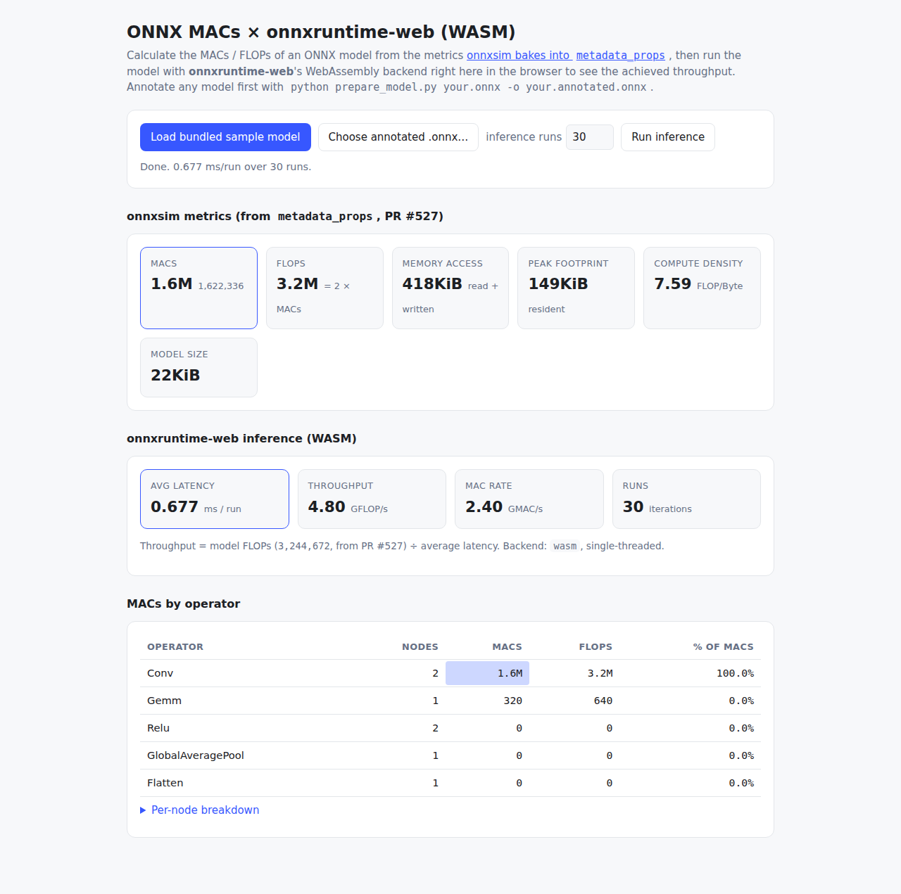

# ort-web-macs — MACs of ONNX models on onnxruntime-web (WASM)

Calculate the **MACs / FLOPs** of an ONNX model from the metrics onnxsim bakes
into the model's `metadata_props` (added in
[onnxsim#527](https://github.com/onnxsim/onnxsim/pull/527)), and run the same
model with **[onnxruntime-web](https://onnxruntime.ai/docs/tutorials/web/)**'s
WebAssembly backend in the browser to see the achieved throughput.



## How it works

onnxsim's `model_info.annotate_metadata` computes the compute/memory metrics
(Conv, ConvTranspose, Gemm, MatMul, Attention and their quantized twins) and
writes them into the ONNX protobuf under keys prefixed with `onnxsim.`:

| level | keys |
| --- | --- |
| model | `onnxsim.macs`, `onnxsim.flops`, `onnxsim.mem_access`, `onnxsim.memory_footprint`, `onnxsim.compute_density`, `onnxsim.model_size` |
| node | `onnxsim.macs`, `onnxsim.flops`, `onnxsim.mem_access` |
| value | `onnxsim.bytes` |

onnxruntime-web does **not** expose `metadata_props` through its JavaScript API,
so [`onnx-macs.js`](onnx-macs.js) reads them straight out of the model bytes
with a tiny, dependency-free protobuf scanner that walks only the fields it
needs. Because the metrics travel *inside* the model file, the browser needs
nothing but the `.onnx` itself — the numbers were computed once, offline.

The reported throughput is simply the model's annotated FLOPs divided by the
average onnxruntime-web inference latency (GFLOP/s). Dynamic dimensions
(`dim_param`, e.g. `batch`) stay symbolic in the annotation (e.g.
`512*batch`); those are shown as the formula, and throughput is only computed
for concrete shapes.

## 1. Annotate a model (offline)

`prepare_model.py` writes the metrics into a model's `metadata_props`. It needs
`onnx` plus onnxsim's optional metric deps:

```bash
pip install onnx numpy sympy rich
```

Build and annotate the bundled demo model (a tiny CNN classifier — no download):

```bash
python prepare_model.py --demo -o sample_model.annotated.onnx
```

Or annotate your own model:

```bash
python prepare_model.py path/to/model.onnx -o model.annotated.onnx
```

> The script imports `onnxsim/model_info.py` directly. If the compiled onnxsim
> extension is installed it uses the real `annotate_metadata` (C++ metrics);
> otherwise it falls back to the identical pure-Python annotation path, so the
> example works even without building onnxsim.

## 2. Run the browser demo

The demo is a static page — no build step. Serve this folder and open it (a
server is needed so the page can `fetch` the sample model and load the WASM
runtime):

```bash
python -m http.server 8000
# then open http://localhost:8000/examples/ort-web-macs/  (adjust the path)
```

- **Load bundled sample model** parses `sample_model.annotated.onnx` and shows
  its MACs/FLOPs and a per-operator breakdown.
- **Choose annotated .onnx…** does the same for any model you annotated in
  step 1 (loaded locally — nothing is uploaded).
- **Run inference** creates an onnxruntime-web session on the `wasm` backend,
  feeds random inputs of the right shape, times an average over N runs, and
  reports GFLOP/s from the annotated FLOPs.

onnxruntime-web is loaded from a CDN and configured single-threaded so the page
works from a plain static server (multi-threaded WASM would need COOP/COEP
cross-origin isolation headers).

### The demo model's MACs are hand-checkable

```
Conv1 : (1*16*32*32) * 3  * (3*3) =   442,368
Conv2 : (1*32*16*16) * 16 * (3*3) = 1,179,648
Gemm  :  1*10*32                  =       320
total                             = 1,622,336 MACs  (3,244,672 FLOPs)
```

## Files

| file | purpose |
| --- | --- |
| `index.html` | the browser demo (loads `onnx-macs.js` + onnxruntime-web) |
| `onnx-macs.js` | ES module: read `metadata_props` metrics + drive ORT-web inference |
| `prepare_model.py` | annotate a model (or build the demo model) with onnxsim metrics |
| `sample_model.annotated.onnx` | pre-annotated demo model |
| `test_node.mjs` | dev check: parse + run the sample under Node |
| `verify_browser.mjs` | dev check: drive `index.html` headless via Playwright |

## Developer checks (optional)

```bash
npm install                 # onnxruntime-web + playwright (dev only)
npm run test:node           # verifies the parser and ORT-web WASM inference
npx playwright install chromium
npm run test:browser        # drives index.html in headless Chromium
```
